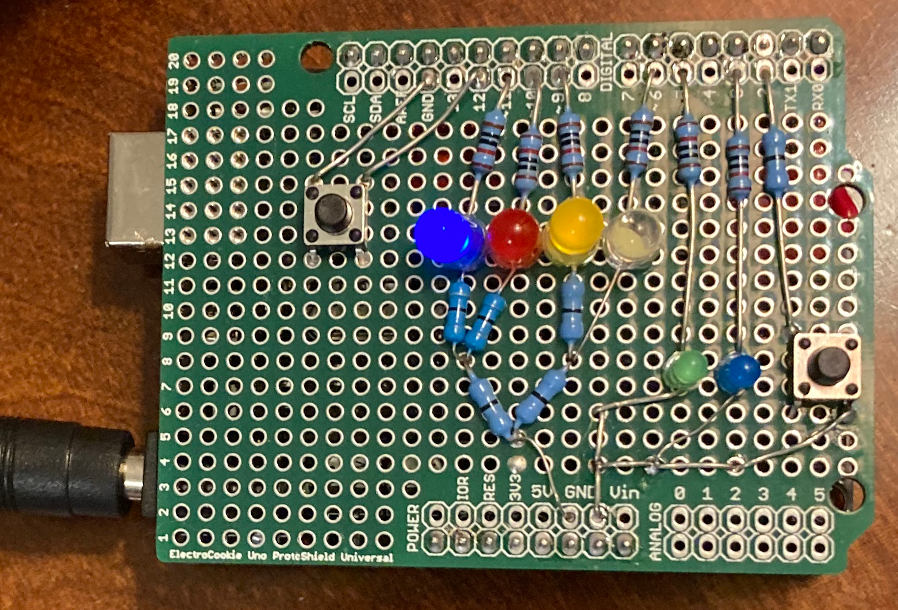

## Implementation Details

(These are notes for me, but if you're interested, please read).

The clock is driven by an Arduino microcontroller.  I'm partial to the one by "Elegoo", which is $14
as of when I'm writing this:
[https://www.amazon.com/ELEGOO-Board-ATmega328P-ATMEGA16U2-Compliant/dp/B01EWOE0UU](https://www.amazon.com/ELEGOO-Board-ATmega328P-ATMEGA16U2-Compliant/dp/B01EWOE0UU), however I'm tinkering with a cheaper (Nano [https://www.amazon.com/gp/product/B0713XK923](https://www.amazon.com/gp/product/B0713XK923)), which is under $6.
The Arduino, conveniently, has six "PWM" outputs, where you can set the output value.
I use these to control the dimming of the LED's.  Without them, I'd have to hardwire the
brightness using resistors.

For my first clocks, I 
soldered the LED's and resistors onto a generic "shield".  This is a circuit board that is
designed to stack on top of the Arduino, and has a grid of holes for you to solder in your circuits.
My first set used shields from
"ElectroCookie" ([https://www.amazon.com/gp/product/B08MTFY2PR](https://www.amazon.com/gp/product/B08MTFY2PR)).
I wasn't happy with these because there are three different
shields, and I'd rather just have the blue shield, which has multiple holes pre-wired and nice
strips of ground holes.  The green shield is in the picture below, and is a pain because it
only has three ground holes, and I need eight.
I picked up blue shields from Ebay ([https://www.ebay.com/itm/172443976013](https://www.ebay.com/itm/172443976013)), but that listing might go away.  You can search "For Arduino UNO R3 Shield Board Prototype PCB DIY Combo 2mm+2.54mm Pitch" -- seller "modulefans", from China).

By the time those blue shields arrived from China, I decided to explore making my own circuit
board for the clock.  I used `easyeda.com` and it only took me one failed fabrication
pass to get it right.  They are nice and cheap -- $4 for 10 (of course, shipping from China is
something like $8 for two weeks.  That's still $1.20 per board).

I use 10K-ohm resistors typically (22K-ohm have worked too).  When the lights are off in our
bedroom, the LED's are pretty bright, and the dimming feature helps greatly.

When using the generic shields, I'm partial to zero ohm resistors instead of wires.
They make the board look cleaner
(in the picture above, all of those resistors on the bottom are zero ohm, and I wish I
had simply used them for all of the wiring, but I was feeling cheap.  I think the
fan-out at the bottom would look much cooler had I used zero ohm resistors for all of 
the wires. 

You need to put some tape (I use duct tape) over the Elegoo's LED's.
Otherwise, they are really bright and interfere with the lights of the clock.
The custom PCB hides them better than the shields, but it's still better to use tape.

Someday when I'm bored, I'll make one of these with Neopixels.  6 neopixels = $3, and
I only need one PWM port rather than six.
