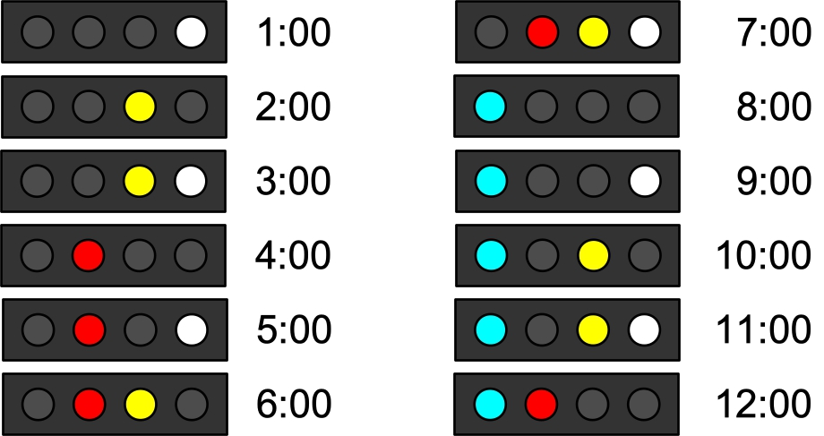
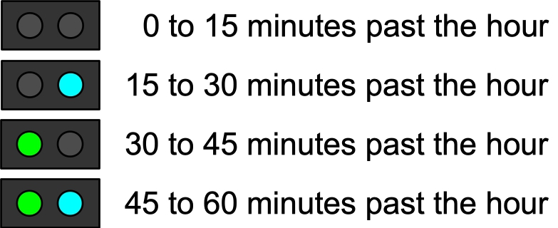
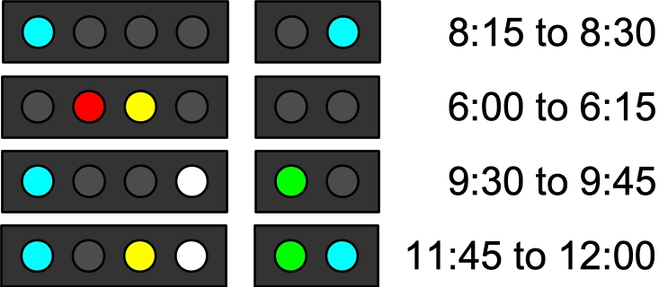

# Thorpaw's Binary Sleeping Clock

James S. Plank

Video Instructions May Be Found At: [https://youtu.be/wY6YnzzrMSk](https://youtu.be/wY6YnzzrMSk).

------
## Introduction

Thorpaw's Binary Sleeping Clock is a clock with six lights.  Four of them keep track of the
hour, and the remaining two keep track of the 15-minute interval within the hour.  Therefore,
by looking at it, you know roughly what time it is, but with a minimum of information being
transmitted to you.

I have a typical clock pictured below -- If you have one, it may differ slightly,
but it will be close enough for you to follow along.

Each clock features:

- A bank of four lights, colored blue, red, yellow and white.
- A set of two lights, usually smaller, which are green and blue.
- Two buttons -- one on the left and one on the right.

----------
## Reading the hours

The four lights are binary digits for the hours.  You read them as numbers from 1 to 12.
Here's how the lights correspond to hours:

In other words:

- White is the one's digit (zero when off, one when on).
- Yellow is the two's digit (zero when off, two when on).
- Red is the four's digit (zero when off, four when on).
- Blue is the eight's digit (zero when off, eight when on).

So, for example, when the red and white lights are on, you add four (red) plus one (white)
to get five.

-------
## Reading the quarter-hours

The green and blue lights show the quarter hour:

-------
## Practice

Here are four light-settings for practice.  I can tell you the important one for me is seeing
the blue light in the morning, which tells me that it's 8:00, and I typically have about an 
hour before I have to get up:

-------------
## Setting the Clock / The Buttons

Here are the functions of the buttons:

- *Left button, quick press:* Changes the hour.
- *Left button, hold down:* Changes the quarter-hour.
- *Right button, quick press:* Dims the lights (eight settings, and then it resets).
- *Right button, hold down:* Changes the minutes after the quarter hour.  This may
     confuse you, so keep reading.
</UL>

When you're setting the clock, do the following three steps:

1. Set the hour, using quick pressed of the left button.
2. Once you have set the hour, set the quarter hour by holding down the left button.
3. Now set the minutes after the quarter hour, by holding down the right button.  The
     bank of four lights will cycle through the numbers from one to fourteen.  Release
     the button at the correct time.

Why do you need to set the minutes after the quarter-hour when you can't see them on the
clock?  The answer is that the clock needs to know when to change the quarter-hour and the hour.

You might need to think a little here if the quarter hour is blue (15-30) or blue+green (45-60).
You add the minutes to the quarter hour, so, for example
it's 18 minutes after the hour, then you need to set the quarter hour to blue, and then
hold down the right button until the yellow and white lights are on: 15+3 = 18.

---------
## Dimming the lights

The clock is pretty bright at night, so you'll likely want to dim it.  Do that with quick presses
of the right button.  There are 8 levels of dimness, and after you get to the last, it will cycle
back to the first. 

